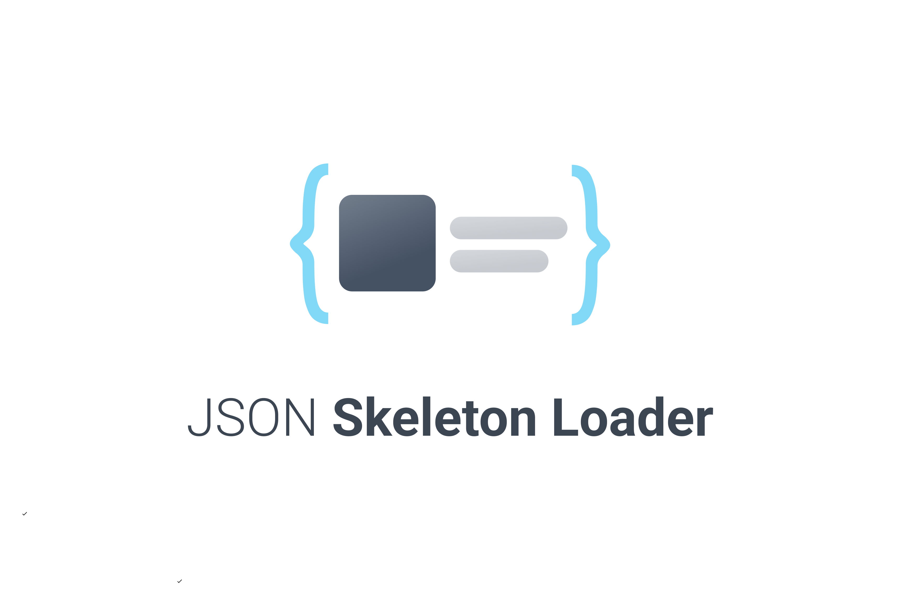

[ [](https://github.com/medistream-team/v-skeleton-loader/actions/workflows/npm-publish.yml)

## [DEMO]()

## Installation

<pre>
<code>npm install react-json-skeleton-loader</code>
</pre>

## Plugin

<pre>
<code>import JsonSkeletonLoader from 'react-json-skeleton-loader';</code>
</pre>

## Component

### Content

You can implement multiple types of skeleton loaders simultaneously using content property.

```html
import JsonSkeletonLoader from 'react-json-skeleton-loader'

const temp = () => {
  return (
    <JsonSkeletonLoader
      defaultSize={{
        box: 100px,
        circle: 100px
      }}
      content={[['box', 'title + text:3'], [text:3]]}
      />
  )
}
```

```html
import JsonSkeletonLoader from 'react-json-skeleton-loader'

const temp = () => {
  return (
    <JsonSkeletonLoader
      defaultSize={{
        box: 100px,
        circle: 100px
      }}
      content={[['box', 'blink', 'title + text:3'], ['text:3'], ['box', 'text:2']}
      />
  )
}
```

### Options

Options allow you to implement different styles of Skeleton Loaders.

```html
import JsonSkeletonLoader from 'react-json-skeleton-loader'

const temp = () => {
  return (
    <JsonSkeletonLoader
      defaultSize={{
        box: 100px,
        circle: 100px
      }}
      options={{
        speed: 0.5,
        radius: 15,
        primaryColor: '#ffb0b0',
        secondaryColor: '#4c8bf5'
      }}
      content={[['box', 'title + text:3'], [text:3]]}
      />
  )
}
```

## 📝 License

Copyright © 2022. Built by INTEGRATION Corp.<br>
This project is distributed under [MIT](https://github.com/medistream-team/v-skeleton-loader/blob/main/LICENSE) license.
